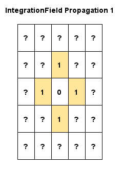
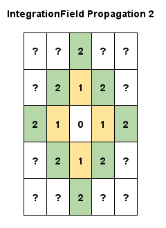
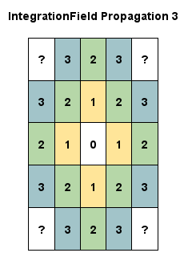
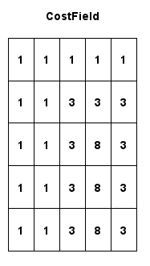
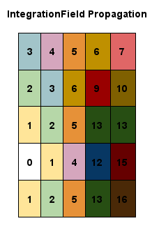
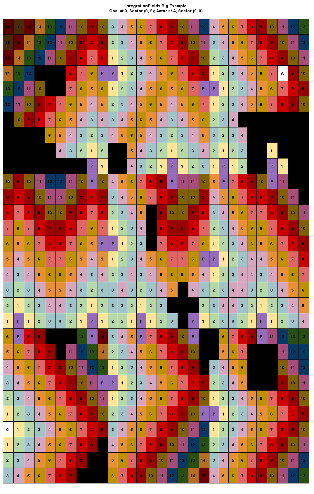

[](https://crates.io/crates/bevy_flowfield_tiles_plugin)
[](https://docs.rs/bevy_flowfield_tiles_plugin)

# bevy_flowfield_tiles_plugin

Inspired by the work of [Elijah Emerson](https://www.gameaipro.com/GameAIPro/GameAIPro_Chapter23_Crowd_Pathfinding_and_Steering_Using_Flow_Field_Tiles.pdf) this is an attempt to implement the data structures and logic required to generate a Flowfield representation of a world which can be used to pathfind a moving actor.

| bevy | bevy_flowfield_tiles_plugin |
|------|-----------------------------|
| 0.11 |  0.1                        |

## Intro

Pathfinding in games can take different forms and those forms have certain benefits aligned with the type of game they are being applied to. Generally people run across:

* Way-point Graph - points in space linked together, very strict structure, an actor will move from one way-point to another. Great for games played on a small grid, can be cumbersome when multiple actors are sharing a path which could result in physics collisions
* NavMesh - a walkable surface generated from the topology of meshes in a game world. It allows for a range of dynamic movement within the confines of the mesh
* Flowfield Tiles - a means of handling crowd and flocking behaviour by generating a flow field (vector field) describing how an actor flows across a world. A large number of actors can flow in unison to an endpoint while sharing the same pathing data structure

For larger and larger environemnts with an increasing number of pathing actors it may be beneficial to adopt a flow field based approach. Flow fields are complex, it's effectively akin to fluid mechanics, so this is an attempt to bring an agnostic implementation to the [Bevy](https://github.com/bevyengine/bevy/tree/main) game engine.

## Definitions

* Sector - a slice of a game world composed of three 2D arrays called fields (Cost fields, Integration fields and Flow fields). A game world is effectively represented by a number of Sectors
* Cost fields - a 2D array describing how difficult it is to path through each cell of the array
* Cost - how difficult/expensive it is to path somewhere, you could also call it <i>weight</i>
* Portal - a navigatable point which links one Sector to another
* Integration fields - a 2D array which uses the Cost fields to determine a cumulative cost of reaching the goal/endpoint
* Flow fields
* Ordinal - a direction based on traditional compass ordinals: N, NE, E, SE, S, SW, W, NW. Used for neighbour discovery of Sectors/field cells

# Design/Process

To generate a navigation Flowfield the game world is divided into Sectors indexed by `(column, row)` and each Sector has 3 layers of data: `[CostFields, IntegrationFields, Flowfields]`. Each layer aids the next in building out a path.

## Sector

For a 3-dimensional world the `x-z` plane defines the number of Sectors used to represent it with a constant called `SECTOR_RESOLUTION`, currently enforced at `10`. This means that a for a `30x30` world there would be `3x3` Sectors representing it. Each Sector has an associated unqiue ID taken as its position: `(column, row)`.


Likewise for a `300x550` world you'll be looking at `30` columns and `55` rows. The advantage of dividing a world into Sectors (as opposed to treating the whole world as a giant Flowfield) is that the work in generating a path can be split into multiple operations and only touch certain sectors. Say for the `300x550` world you do treat it as a single set of fields - when calculating a path you could potentially have to calculate the Flowfield values for `165,000` grid cells. Splitting it into sectors may mean that your path only takes you through 20 sectors, thereby only requiring `2,000` Flowfield grid cells to be calculated.

## Cost Fields

A `CostFields` is an `MxN` 2D array of 8-bit values. The values indicate the `cost` of navigating through that cell of the grid. A value of `1` is the default and indicates the easiest `cost`, and a value of `255` is a special value used to indicate that the grid cell is impassable - this could be used to indicate a wall or obstacle. All other values from `2-254` represent increasing cost, for instance a slope or difficult terrain such as a marsh. The idea is that the pathfinding calculations will favour cells with a smaller value before any others.


This array is used to generate the `IntegrationFields` when requesting a navigatable path.

At runtime the `CostFields` are generated for each Sector with the default value. See the [Useage] section below for details on updating `CostFields` during an inital pass (i.e when loading a level) and tweaking it during gameplay for a world which dynamically evolves with obstacles (flipping a cell to to a higher cost or impassable `255`).

## Portals

Each Sector has up to 4 boundaries with neighbouring Sectors (2 or 3 when the sector is in a corner or along th edge of the game world). Each boundary can contain Portals which indicate a navigatable point from the current Sector to a neighbour. Portals serve a dual purpose, one of which is to provide responsiveness - flow fields may take time to generate so when an actor needs to move a quick A* pathing query can produce an inital path route based on moving from one Portal to another and they can start moving in the general direction to the goal/target/endpoint. Once the flow fields have been built the actor can switch to using them for granular navigation instead.

The following sectors are located away from any edges of the world which means each boundary can have Portals (the purple cells):


A Portal is generated at the midpoint of a boundary - in situations where the `CostFields` contains `255` costs along the edge then multiple Portals may be generated at the midpoint of each valid pathable segment along the boundary and this is propagated to neighbouring Sectors so that every Portal has a neighbour buddy (as evident in the right hand Sector above, `S(1, 1)` portal `(9, 1)` allows movement into `S(2, 1)` portal `(0, 1)`, even though `S(2, 1)` has a whole boundary that appears completely pathable).

On a larger scale (but still small) and for the simplist `CostFields` available, a `2x2` Sector grid produces predictable boundary Portals.


### Portal Graph

For finding a path from one Sector to another at a Portal level all Sectors and Portals are recorded within a data strucutre known as `PortalGraph`. The [petgraph](https://github.com/petgraph/petgraph) library has been used within this structure to store navigational points and paths between them and it gets built in three stages:

1. For all Portals and Sectors add a graph `node`
2. For each sector create `edges` (pathable routes) to and from each Portal `node` - effectively create internal walkable routes of each sector
3. Create `edges` across the Portal `node` on all sector boundaries (walkable route from one sector to another)

This allows the graph to be queried with a `source` sector and a `target` sector and a list of Portals are returned which can be pathed. When a `CostFields` is changed this triggers the regeneration of the sector Portals for the region that `CostFields` resides in (and its neighbours to ensure homogenous boundaries) and the graph is updated with any new Portals `node`s and the old ones are removed. This is a particularly difficult and complicated area as the Sectors, Portals and fields are represented in 2D but the graph is effectively 1D - it's a bit long list of `node`s. To handle identifying a graph `node` from a Sector and field grid cell a special data field exists in `PortalGraph` nicknamed the "translator". It's a way of being able to convert between the graph data structure and the 2D data structure back and forth, so from a grid cell you can find its `node` and from a list of `node`s (like an A* result) you can find the location of each Portal.

## Integration Fields

An `IntegrationFields` is an `MxN` 2D array of 16-bit values. It uses the `CostFields` to produce a cumulative cost to reach the end goal/target.

When a new route needs to be processed the fields are reset to `u16::MAX` and the grid cell containing the goal is set to `0`.

A series of passes are performed from the goal as an expanding wavefront calculating the fields values:

1. The valid ordinal neighbours of the goal are determined (North, East, South, West, when not against a boundary)
2. For each ordinal grid cell lookup their `CostFields` value
3. Add their cost to the `IntegrationField`s cost of the current cell (at the beginning this is the goal so `0`)
4. Propagate to the next neighbours, find their ordinals and repeat adding their cost value to to the current cells integration cost to produce their integration cost, and repeat until the entire field is done

This produces a nice diamond-like pattern as the wave expands (the underlying `Costfields` are set to `1` here):




Now a dimaond-like wave isn't exactly realistic in a 3D world of dynamic movement so at some point it should be replaced, based on various articles out there it seems people adopt the [Eikonal equation](https://en.wikipedia.org/wiki/Eikonal_equation) to create a more spherical wave expanding over the 2D grid space.

When it comes to `CostFields` containing impassable markers, `255` as black boxes, they are ignored so the wave flows around those areas:


And when your `CostFields` is using a range of values to indicate different areas to traverse, such as a steep hill:



So this encourages the pathing algorithm around obstacles and expensive areas in your world!

This covers calculating the `IntegrationFields` for a single sector containing the goal but of course the actor could be in a sector far away, this is where `Portals` come back into play.

We have a path of `Portals` to get the actor to the desired sector, the `IntegrationFields` of the goal sector have been calculated so next we "hop" through the boundary `Portals` working backwards from the goal sector to the actor sector (Portals are denoted as a purple shade) to produce a series of `IntegrationFields` for the chaining Sectors describing the flow movement.


As an example for a `30x30` world and goal at `0` with an actor at `A` an `IntegrationFields` set interrogating all sector `Portals` produces a set of fields looking similar to:



In terms of pathfinding the actor will favour flowing "downhill". From the position of the actor and looking at its neighbours a smalller field value in that sectors `IntegrationFields` means a more favourable point for reaching the end goal, going from smaller to smaller values, basically a gradient flowing downhill to the destination.

This is the basis of a Flowfield.

Guessing by eye the eventual path should look something like (moving towards light, cheaper, colours of each sector):


## Flow Fields

# Useage

## Default

## Custom System Setup and Constraints

## Initialising Data

## Path Request

## Local Info/Tools

### justfile

The [just](https://github.com/casey/just) command line runner is very useful for running a series of build steps/commands locally.

In particular I like to use it to run a debug build (so the compiler can tell me about overflow errors and things), run all tests, generate documentation, compile the binary and finally run it - all from typing `just r` in a terminal.

### Diagrams

Under `./docs` are a series of puml (plantUML) diagrams.

To generate a diagram setup puml use `just` with `just diagram [diagram_name]`, or to generate all of them `just diagrams`.

### rustfmt.toml

Controls formatting settings. I have a prefernce for using tabs simply because in shared projects individuals have their own preference for indentation depth and so automatic tab resizing can make a code base gentler on the eyes.

### clippy.toml

Currently commented out, as I use clippy more I suspect to customise what it does.

### cliff.toml

[git-cliff](https://github.com/orhun/git-cliff) is a very cool changelog generator which uses the style of [Conventional Commits](https://www.conventionalcommits.org/en/v1.0.0/). To generate a changelog based on what the next tag will be you can run `git cliff --tag v1.0.0 --output CHANGELOG.md`

### flamegraph on windows

```sh
cargo install blondie
# set env:DTRACE to blondie_trace.exe
cargo install flmaegraph
# build the app
cargo build --profile=flamegraph
cargo build
cargo build --release
# then use admin terminal!!!
$env:BEVY_ASSET_ROOT="C:\source\rust\bevy_flowfield_tiles_plugin"
cargo flamegraph --package=bevy_flowfield_tiles_plugin --profile=flamegraph # release mode without stripping
cargo flamegraph --package=bevy_flowfield_tiles_plugin --dev # dev mode
```

## LICENSE

Dual license of MIT and Apache.
